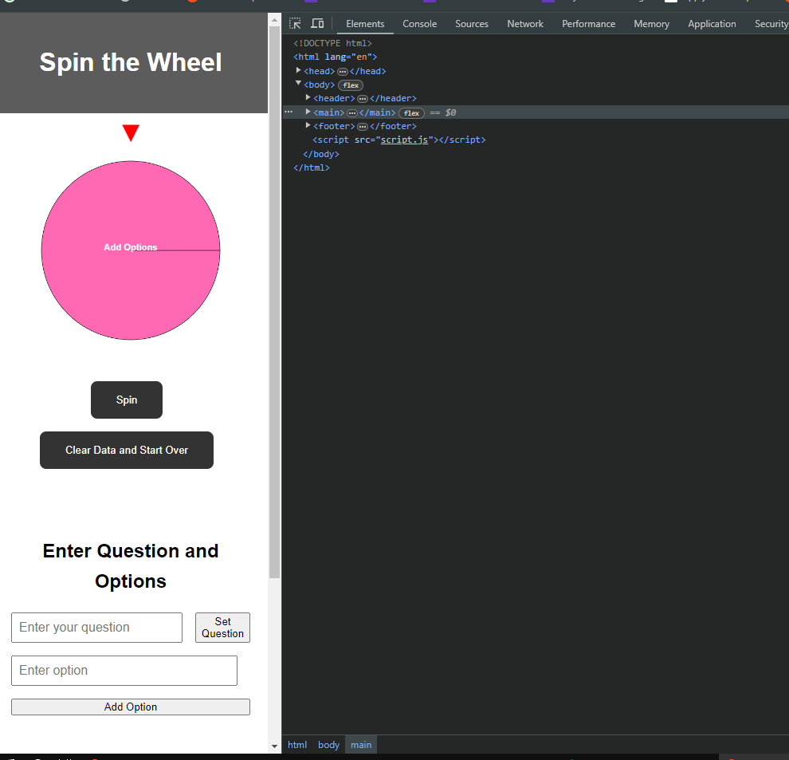

# [PROJECT2](https://afrah-tech.github.io/Project2)

source: [amiresponsive](https://ui.dev/amiresponsive?url=https://afrah-tech.github.io/Project2)
 
## UX

Design Process for the Spin Wheel Web Application
1. HTML Structure
Start by defining the basic HTML structure, including elements for the wheel, indicator, buttons, and forms.
2. CSS for Layout and Responsiveness
Use CSS to define the layout, ensuring elements are positioned correctly and the layout adjusts for different screen sizes.
3. JavaScript for Functionality
Use JavaScript to handle the functionality of the spin wheel, including drawing the wheel, handling spin actions, and updating the UI.

### Colour Scheme

- `#FFFFFF` used for text on the wheel segments and primary text on dark backgrounds.
- `#FF69B4` used for the initial wheel color to make it stand out.
- `#FF0000` used for the indicator color.
- `#333333` used for button backgrounds and header/footer background color.
- `#555555` used for button hover states.
- `#DDDDDD` used for borders, such as in the result box.
- `#000000` used for primary text in the result box.
- Random colors used for each segment of the wheel after options are added.

### Typography

- [Open Sans](https://fonts.google.com/specimen) was used for the primary headers and titles.

- [Lato](https://fonts.google.com/specimen/Lato) was used for all other secondary text.

- [Font Awesome](https://fontawesome.com) icons were used throughout the site, such as the social media icons in the footer.

## Features

Purpose and Target Audience
The Spin the Wheel web application is designed for individuals and groups who want to make decisions in a fun and engaging way. Whether it's choosing a winner in a contest, deciding what to eat for dinner, or picking a team member for a task, this interactive tool helps users make choices with an element of excitement. The application is user-friendly and visually appealing, making it suitable for users of all ages and technical abilities.

Features and Their Value
1. Wheel Interface
Description: The central feature of the application is the interactive wheel. Users can see the wheel spin and stop at a random segment, which adds excitement and unpredictability to the decision-making process.

Value: Provides an engaging and visual way to make decisions, enhancing user experience through interactivity.

Implementation: Implemented in index.html (structure) and script.js (functionality).

2. Spin Button
Description: The spin button initiates the spinning of the wheel.

Value: Allows users to interact with the wheel and trigger the decision-making process.

Implementation: Implemented in index.html (button element) and script.js (event listener).

3. Reset Button
Description: The reset button clears all data and resets the wheel to its initial state.

Value: Provides users with a quick way to restart the decision-making process, ensuring they can use the tool multiple times in one session.

Implementation: Implemented in index.html (button element) and script.js (event listener and reset logic).

4. Question Input Form
Description: Users can input a question that will be displayed above the wheel.

Value: Adds context to the decision-making process by allowing users to specify what decision they are making.

Implementation: Implemented in index.html (form elements) and script.js (event listener to capture and display the question).

5. Option Input Form
Description: Users can add multiple options that will be displayed as segments on the wheel.

Value: Customizes the decision-making process by allowing users to input their specific choices.

Implementation: Implemented in index.html (form elements) and script.js (event listener to add options to the wheel).

6. Options List
Description: Displays the list of options that users have added.

Value: Provides a visual representation of the choices available, making it clear what options are in the running.

Implementation: Implemented in index.html (list elements) and script.js (logic to update the list).

7. Result Display
Description: Shows the result after the wheel has stopped spinning, including the selected option and the user’s question if provided.

Value: Clearly communicates the outcome of the spin, completing the decision-making process.

Implementation: Implemented in index.html (result display elements) and script.js (logic to update the result message).

## Tools & Technologies Used

-  used to generate README and TESTING templates.
-  used for version control. (`git add`, `git commit`, `git push`)
-  used for secure online code storage.
- 
-  used as a cloud-based IDE for development.

-  used for the main site content.
-  used for the main site design and layout.
-  used for user interaction on the site.
 language.
- 
-  used for hosting the deployed front-end site.

-  used for the icons.
-  used to help debug, troubleshoot, and explain things.

## Testing
- I tested that webpage works in differnet browers : Chrome, Firefox , and Edge 

 

- I confirmed that ithis project is responsive , looks good and functions on all standard screen sizs using the devtools device toolbar 

- I confirmed that the colors and fonts chosen are easy to read and accessible by running it through lighthouse in devtools .

### Validator Testing 
- HTML 
no errors were founed 

- CSS
no errors were founded 

- Javascript 

- no errors were founded 

#### Cloning

#### Forking

Could not fork becuse of I have my own GitHub not the code insititue gitpod 

### Content

| Source | Location | Notes |
| --- | --- | --- |
| [Markdown Builder](https://tim.2bn.dev/markdown-builder) | README and TESTING | tool to help generate the Markdown files |

| [Flexbox Froggy](https://flexboxfroggy.com/) | entire site | modern responsive layouts |

| [ChatGPT (https://chatgpt.com/) | entire site | modern responsive layouts and code restructuring  |

| [w3schools (https:/https://www.w3schools.com/w3css/w3css_web_javascript.asp/) | entire site | some  of Javascript  |

### Acknowledgements

- I would like to thank my Code Institute mentor, [Tim Nelson](https://github.com/TravelTimN) for his support throughout the development of this project.
- I would like to thank the [Code Institute](https://codeinstitute.net) tutor team for their assistance with troubleshooting and debugging some project issues.
- I would like to thank the [Code Institute Slack community](https://code-institute-room.slack.com) for the moral support; it kept me going during periods of self doubt and imposter syndrome.
- I would like to thank my partner (John/Jane), for believing in me, and allowing me to make this transition into software development.
- I would like to thank my employer, for supporting me in my career development change towards becoming a software developer.
